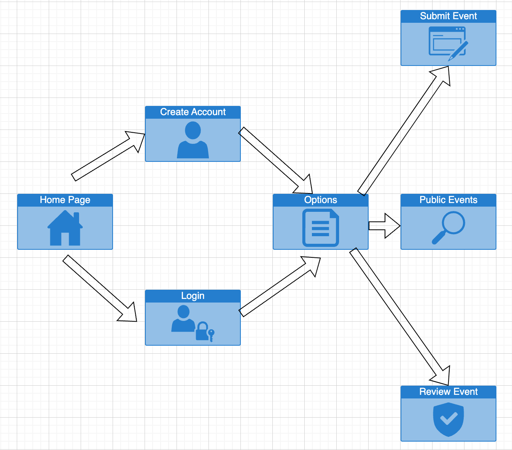
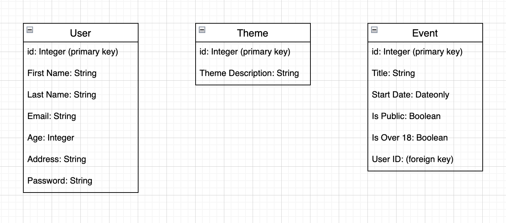
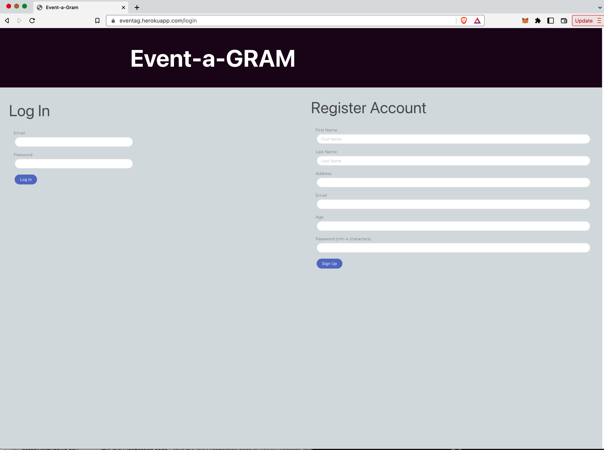
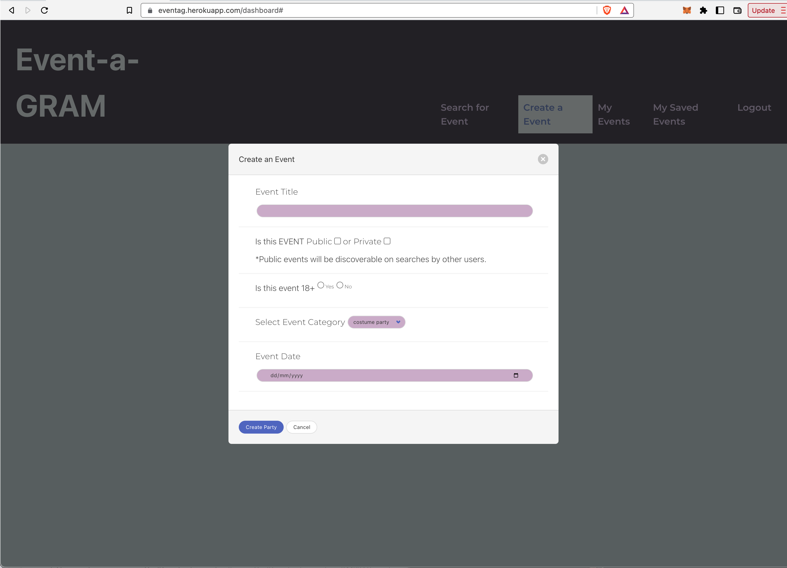
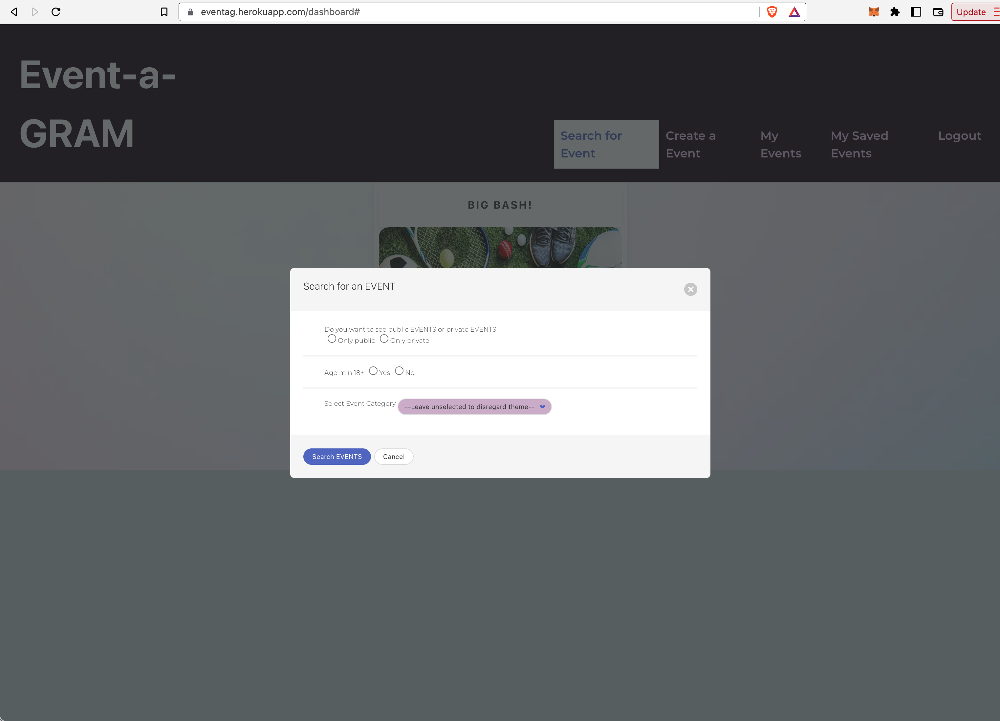
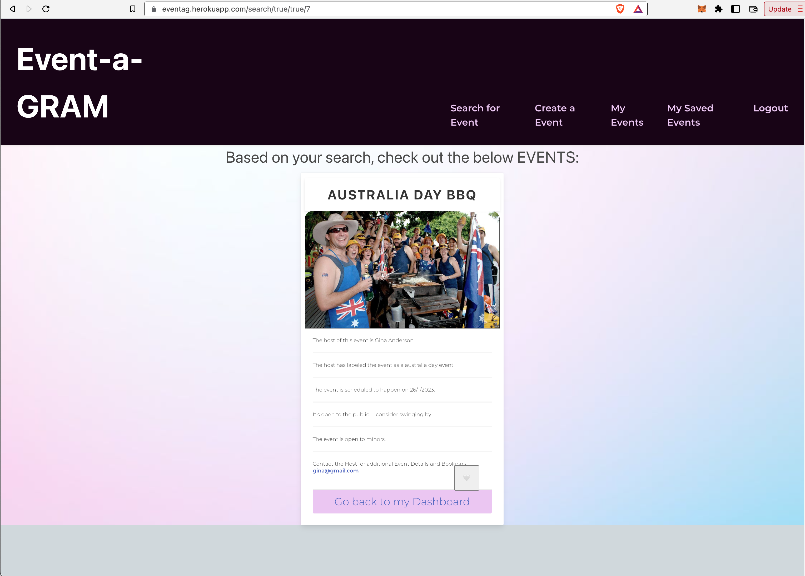

# EVENT-A-GRAM

A webapp which allows users to create and search for a range of local events.

### DEPLOYED APPLICATION 
https://eventag.herokuapp.com/
The webapp is deployed on Heroku, so no special instructions are required, simply click on the link. 


## Installation
The user should clone the repository from GitHub. 

     git clone https://github.com/GEEZEE91/EVENT-A-GRAM/

To connect to the database run and enter password. 

    mysql -u root -p 

Source the schema.sql.

    source db/schema.sql
  
Exit my sql

Install dependencies

    npm i
  
To seed the file run

    npm run seed
 
After installations is completed, run the app with below in terminal

    npm start

## TEAM MEMBERS

```md
-Gina Zivkovic (Team Leader): https://github.com/GEEZEE91
-Ash Shilkin: https://github.com/web3zero
-Zubair Hassam: https://github.com/Zubair-Hassam 
```

## DESCRIPTION 
We created a webapp that allows users to login, create events under a number of categories, and edit the events if needed.


## FUNCTIONALITY
Centralised location for events hosted by individuals or small groups; as opposed to large scale events. 


### EVENT DETAILS
Can be public or private. All ages or over 18. 


SEARCH CAPABILITIES
Users can search for events based on category, age group and private Vs public. 

## Resources
-   [JavaScript](https://developer.mozilla.org/en-US/docs/Web/JavaScript)
-   [NodeJS](https://nodejs.org/)
-   Node Packages:
    -   [MySQL2](https://www.npmjs.com/package/mysql2)
    -   [Sequelize](https://www.npmjs.com/package/sequelize)
    -   [dotenv](https://www.npmjs.com/package/dotenv)
    -   [express](https://www.npmjs.com/package/express)

## License 
This project is license under MIT
  

PLANNING

## Website flow


## Database Schema diagram


## Website images










